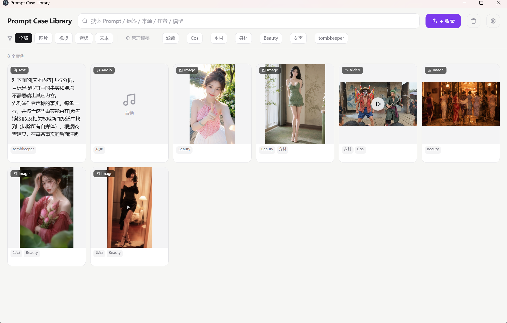
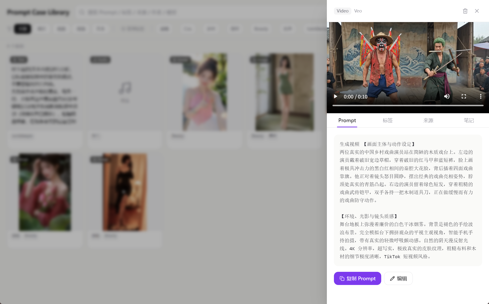

# Prompt Vault

一个本地优先的 Prompt 管理工具，用来收集、整理和复用 AI 创作案例。




我做它的原因很简单：提示词、图片案例、视频 Prompt、模型信息和来源经常散落在相册、收藏夹、聊天记录和各种笔记软件里。真正要用的时候，反而很难找到。

Prompt Vault 希望解决这个问题：把不同类型的 Prompt 和案例统一收进一个本地素材库里。

## Features

### Prompt Management

- 支持图片、视频、音频、纯文本四种类型
- 支持拖拽上传、点击上传
- 自动识别媒体类型：Image / Video / Audio / Text
- 一条案例可附加多张图片
- Prompt 文本支持查看、编辑和一键复制

### Browse & Search

- Pinterest 风格卡片网格
- 类型筛选：全部 / 图片 / 视频 / 音频 / 文本
- 多标签筛选，支持 AND 逻辑
- 全文搜索：Prompt、标签、来源、作者、模型
- 视频卡片 hover 自动静音播放，移开暂停

### Detail Panel

每条案例都有一个右侧详情面板，包含：

- Prompt：完整文本、复制、编辑
- Tags：添加、删除标签
- Source：链接、作者、模型、收藏日期
- Notes：Markdown 笔记、编辑、复制

### Tags & Models

- 支持预设标签和自定义标签
- 标签可改名、删除，并批量更新所有案例
- 填写来源或作者时，自动添加"转载"标签
- 模型名称可从已有案例中自动提取
- 支持自定义模型输入
- 模型可改名、删除，并批量更新

### Safety

- 30 天回收站
- 删除后 5 秒内可撤销
- 误删内容可恢复
- 彻底删除时才会清理本地磁盘文件

### Batch Actions

- 支持多选卡片
- 支持 Ctrl + 点击选择
- 批量打标签
- 批量删除

### Local Storage

- 元数据存储在 IndexedDB
- 媒体文件存储在本地磁盘
- 支持自定义存储路径
- 文件自动分类：
  - `images/`
  - `videos/`
  - `audio/`
- 文件命名格式：`日期时间_UUID.扩展名`
- 支持导入 / 导出元数据 JSON

### Desktop App

- 基于 Electron
- 原生桌面窗口
- 系统保存对话框
- 系统文件夹选择
- 大图全屏预览

## Design

界面设计尽量保持轻量和耐看：

- 浅灰背景：`#F6F6F4`
- 强调色：`#7C3AED`
- 卡片圆角：`14px`
- 细微阴影
- Figma 风格胶囊标签
- 适合长期使用的低干扰视觉风格

## Tech Stack

- Electron
- React + TypeScript
- Tailwind CSS
- IndexedDB（元数据）
- 本地磁盘（媒体文件）

## Getting Started

```bash
git clone https://github.com/rosyriver/prompt-vault.git
cd prompt-vault
npm install
npm run dev
```

## Build

```bash
npm run electron:build
```

## Why Local First

很多 Prompt 和案例并不一定适合放到云端。Prompt Vault 优先使用本地存储，让文件和数据尽量留在自己的设备里。

你可以自己决定媒体文件放在哪里，也可以通过 JSON 导入导出元数据。

## License

MIT
